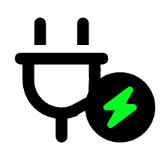

<picture>
    <source media="(prefers-color-scheme: dark)" srcset="icons/plug-transparent-white-1.png">
    <source media="(prefers-color-scheme: light)" srcset="icons/plug-transparent-1.png">
    
</picture>

# (un)Plugged

A [Rainmeter](https://www.rainmeter.net/) skin to load/unload other skins when computer is plugged or on battery

## Installing

See [installing skins](https://docs.rainmeter.net/manual/installing-skins/) for more details.

### Automatic

* Install [rainmeter](https://github.com/rainmeter/rainmeter/releases/latest)
* Open the last release with `SkinInstaller.exe`

### Manual

* Download this repository's zip file and extract the folder located in `Skins` folder into the *Rainmeter* skins folder (defaults to `C:\Users\%USERNAME%\Documents\Rainmeter\Skins` ).

## How to use

This skin will unload other skins when the computer will be on battery, and then reload them when plugged back in. 

In order to change the list of skins, click-left on the widget (text or graphic) and choose `Edit (un)Plugged Config` menu.
You will be redirected to an .ini file. 

Format for `OtherSkins` variable is :
```ini
OtherSkins="skin-name"+"skin-file.ini"|
```
You can repeat this value "skin-name"+"skin-file.ini" for each skin you want to load/unload. Separator for each skin's description is `|`.
It is mandatory to tell the `.ini` file, due to the way Rainmeter API is used.

## Contributing

* Fork the repository: Fork
* Create your feature branch (`git checkout -b my-new-feature`)
* Commit your changes (`git commit -am 'Add some feature'`)
* Push to the branch (`git push origin my-new-feature`)
* Create a new Pull Request! 🎉


## General

* icons from https://free-icons.github.io/free-icons/
* inspiration from [this thread](https://forum.rainmeter.net/viewtopic.php?p=206092) in rainmeter forum
 
## License

Creative Commons Attribution - Non - Commercial - Share Alike 3.0
